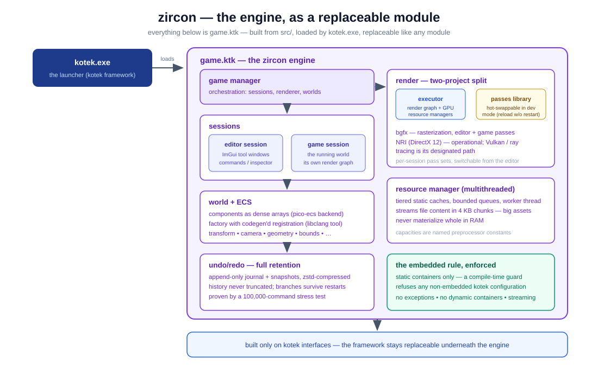
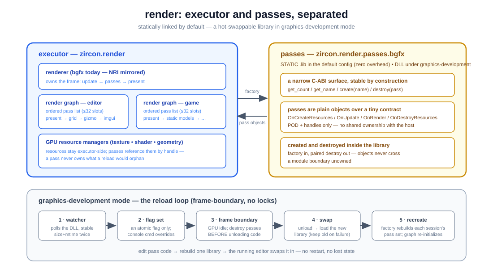
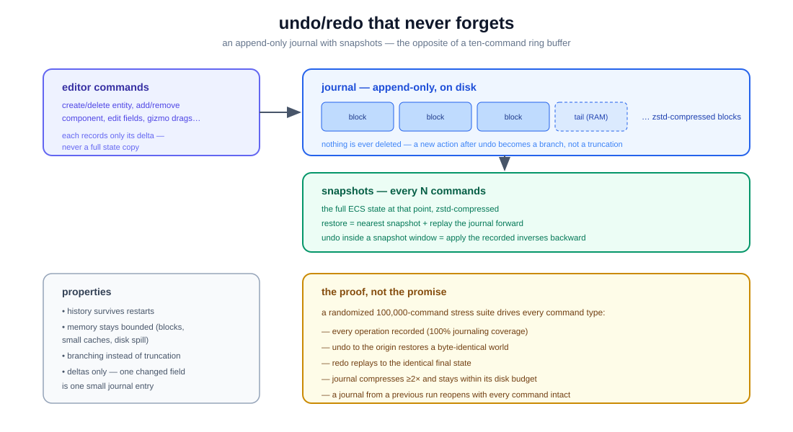

# zircon

[](https://github.com/wh1t3lord/zircon/actions/workflows/build.yml)
[](https://github.com/wh1t3lord/zircon/actions/workflows/tests.yml)

zircon is a game engine built on the [kotek](https://github.com/wh1t3lord/kotek)
framework — and its practical proof. It is the second layer of the stack
(**kotek** → **zircon** → game content) and is developed as an embedded-style
foundation: strict memory budgets, static data structures, and streaming over
materialization.

For non-specialists: if kotek is the groundwork, zircon is the building that
proves the groundwork holds. Everything the framework promises — modularity,
replaceability, discipline — this engine consumes, stresses, and demonstrates
in practice.

## What zircon demonstrates

<p align="center">
  
</p>

- **Embedded discipline enforced at compile time.** The engine builds only
  against kotek's embedded configuration — static containers, no hidden
  reallocation — and a hard compile-time guard rejects any other configuration.
  This is a rule the codebase enforces, not a convention it hopes for.
- **Full-retention undo/redo.** An append-only journal with periodic snapshots:
  history is never truncated and survives restarts. Verified by a 100,000-command
  randomized stress test — full undo to origin is byte-identical, redo replays
  identically, and the journal stays compressed and bounded on disk.
- **Editor and game sessions.** An ImGui-based editor (command history,
  inspector, a runtime render-pass management window, and other tool windows)
  runs beside the game session, each with its own render pipeline.
- **A two-project render architecture.** An executor (render graph and GPU
  resource management) is separated from a pass library that hot-swaps in
  graphics-development mode: edit a render pass, rebuild one library, and the
  running editor reloads it without restarting (its own section below). bgfx
  drives rasterization; NVIDIA NRI (DirectX 12, phase one operational) is the
  Vulkan/ray-tracing path.

<p align="center">
  
</p>

- **The engine as a replaceable module.** zircon itself builds as a single
  loadable module (`game.ktk`) of kotek's launcher — the framework's plugin
  philosophy applied to the engine itself.

<p align="center">
  
</p>

## Flagship feature: hot-swappable render passes

<p align="center">
  
</p>

**What it is.** Rendering is split in two. The executor (`zircon.render`)
owns the frame, the render graphs, and every GPU resource. The pass library
(`zircon.render.passes.bgfx`) owns the passes themselves — present, editor
grid, gizmo, models, imgui. In a default build the library is statically
linked and the split costs nothing. Built with
`ZIRCON_GRAPHICS_DEVELOPMENT=ON`, the same library is a DLL the running
editor reloads on the fly: edit a pass's source, rebuild one library, and the
change is on screen at the next frame boundary — the editor never restarts
and never drops a frame.

**Why it's cool.** Iteration speed is the feature every graphics programmer
feels in their hands, and the mechanism behind it is deliberately boring: a
polling watcher notices the rebuilt DLL, the engine loads a *shadow copy*
(the real file is never locked, so your next rebuild always links), and the
swap happens exactly where it is safe — at a frame boundary, with every pass
destroyed through the library that created it before that library unloads. A
broken build can never take the editor down: a failed candidate is rejected
before the swap and the old library keeps drawing. The same seam carries the
per-session pass sets (scene file → config → built-in default), the Render
Passes editor window (enable, disable, reorder, add, remove at runtime), and
the live classic ↔ GPU-driven A/B toggle for the game's model pass.

**Why modern engines lack it.** Most engines bake their renderer modules into
one monolithic binary: a pass is code-frozen at ship, and "hot reload" means
a scripting layer or an editor restart. A genuinely swappable code library
demands ABI discipline — objects created and destroyed inside the same
module, no ownership shared across the boundary, no module-local statics on
the seam — and most codebases never enforce it, so the feature never becomes
safe enough to ship. Here the discipline is structural: the host and the
library meet at a four-function C-ABI surface (count / name / create /
destroy), passes carry POD and handles only, and GPU resources stay
executor-side by construction.

**The honest review.** The discipline *is* the cost. A reload recreates
passes — it does not migrate them — so a pass that accumulates state must
keep it outside the library. Rich types cannot cross the seam; everything is
names, opaque pointers, and POD. The module-boundary rules are enforced by
asserts and review rather than the type system, and violating one crashes at
the swap, not at the edit. And the mechanism is concrete, not abstract:
Windows + bgfx today, with the NRI pass library shaped for the same split but
not yet reloading. Full protocol:
[doc/git/en/render_passes.md](doc/git/en/render_passes.md).

## Flagship feature: plugin overrides — a framework that cannot die to abandonment

<p align="center">
  
</p>

**What it is.** Every kotek module — containers, logging, math, filesystem,
windowing, render backends — enters and leaves the process through four
uniform entry points (`InitializeModule_*` / `ShutdownModule_*` /
`SerializeModule_*` / `DeserializeModule_*`), and every call to them is
**override-first**: before the built-in runs, the framework consults the
`plugins/` folder next to the data directories. Drop
`plugins/<module-folder-name>.dll` there — or map the module to your own file
name in `plugins/plugins.json` (the json wins) — and your implementation runs
instead of the built-in. In every linkage mode: static `.lib`, implicit
`.dll`, and explicit-load plugin builds alike. zircon itself rides the same
philosophy from the other side: the whole engine is `game.ktk`, the
launcher's replaceable game module.

**Why it's cool.** Replace one module, several, or all of them — a faster
container, a logging backend wired to your infrastructure, a windowing layer
for a platform the project never shipped. No fork, no patch queue, no waiting
on upstream: if the original developers walk away, a community can keep every
part of the framework alive indefinitely, one module at a time. The override
surface is discoverable from the binary itself — `--kotek_plugins_template`
and `--kotek_plugins_modules` write the skeleton files listing every module
the build knows.

**Why modern engines lack it.** DLL-level module replacement needs an
ABI-stable, uniform entry contract maintained across the *whole* codebase —
one signature for every module, a generated registry mapping names to
symbols, and the standing rule that module code only talks through
interfaces. Engines that grew organically bake modules together with direct
calls; by the time replacement is wanted, the call graph is inseparable.
kotek enforced the single invoke macro and the registry from the start, so
override-first dispatch was an additive change rather than surgery.

**The honest review.** Overrides replace whole module entries, not individual
functions, and a plugin can only implement interfaces it knows — extending
the interface set still takes a source change. The entry contract is
deliberately narrow (`bool(ktkMainManager*)`, C linkage); everything richer
flows through the main manager's interface slots. Inside your DLL you live by
the same module-boundary rules as the engine; a failed load or a typo'd
export name falls back to the built-in with only a warning in the log; and a
loaded override stays mapped until the process exits — swapping a plugin
means restarting. Full reference:
[doc/git/en/plugins.md](doc/git/en/plugins.md).

## Who this repository is for

- **Engine programmers** evaluating architecture: the engine shows the
  framework's contracts under real load, including their failure modes and how
  they were fixed (documented in `AGENTS.md`).
- **Students**: a complete, honest example of an engine layer — sessions, ECS,
  command history, render graphs — written to be read.
- **Managers and reviewers**: this is the second of two substantial, working
  repositories designed and maintained end-to-end by one engineer.

## Building

Requirements: a C++20 compiler and CMake 3.19.3+. kotek is a git submodule.

```
git clone --recursive https://github.com/wh1t3lord/zircon.git
cd zircon
mkdir build && cd build
cmake ..
cmake --build .
```

Run from the repository root (data folders are resolved relative to it):

```
build/bin/Debug/kotek.exe --no_splash --kotek_frames=30     # boot, 30 frames, exit
build/bin/Debug/kotek.exe --editor_imgui                     # editor with ImGui UI
build/bin/Debug/kotek.exe --render_nri_dx12                  # NRI (DirectX 12) renderer
```

The full configuration reference — CMake options, runtime arguments, and the
`game_config.json` keys — lives in
[doc/git/en/configuration.md](doc/git/en/configuration.md). The filesystem
usage guide — helpers, streaming, .kpack packing, embedded defaults — lives in
[doc/git/en/filesystem.md](doc/git/en/filesystem.md). The architecture
references for the two flagship features — the render-pass executor/library
split with hot-reload, and the plugin override system — live in
[doc/git/en/render_passes.md](doc/git/en/render_passes.md) and
[doc/git/en/plugins.md](doc/git/en/plugins.md).

## Status and verification

CI builds the engine on every push in the default and full-static
configurations, and nightly across the full matrix (Debug/Release ×
default/static/dynamic — dynamic is a documented, intentionally tolerated
limitation of the current module graph). The test workflow boots the real
engine on the runner: 227 framework tests and 14 engine functional tests,
including the 100,000-command history stress suite.

## About the author

zircon and the kotek framework beneath it are designed and implemented by a
single engineer ([wh1t3lord](https://github.com/wh1t3lord)) — architecture,
engine systems, editor, rendering infrastructure, build and CI pipelines, and
tests. The work is characterized by interface design intended to outlive its
implementations, embedded-grade memory discipline, and an insistence that
every claim in the documentation is verifiable in the repository.
