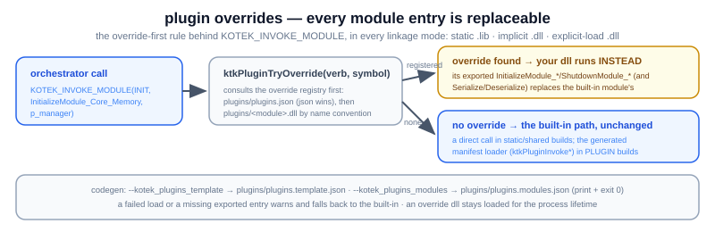

# plugin overrides — replace any module (kotek K21)

How kotek's module replacement works: every module's entry points can be
overridden by a user DLL dropped next to the data directories, in every
linkage mode. Audience: anyone replacing a framework module — one, several,
or all of them. This file is maintained alongside the code — a change to the
override rules, the discovery flags, or the registry updates this page (and
`../zircon_plugin_override.svg`) in the same commit.



## 1. The contract

Every kotek module exposes the same four entry points, all with the uniform,
module-boundary-safe signature `bool (ktkMainManager*)`:

```
InitializeModule_<X>   ShutdownModule_<X>   SerializeModule_<X>   DeserializeModule_<X>
```

Every orchestrator call goes through `KOTEK_INVOKE_MODULE(verb, ns, symbol,
manager)` (`kotek/src/kotek.core.main_manager/include/kotek_plugin_invoke.h`),
and that macro is **override-first in every linkage mode**: before the
built-in runs, it calls `ktkPluginTryOverride(verb, symbol, manager)`
(`.../include/kotek_plugin_override.h`), a tri-state:

- **negative** — no override registered (or the override DLL / symbol failed
  to load; a warning is logged): the macro falls back to the built-in path;
- **0 / 1** — the override entry was called and the value is its `bool`
  result.

No call-site edits are ever needed to make a module replaceable — the
dispatch lives inside the one macro.

## 2. Registering an override

Overrides live in `plugins/` next to the data folders (the working directory
of `kotek.exe`). Two registration variants, scanned json-first so **the json
wins** (`override_scan_json` runs before the name-convention scan and
registered slots are not re-taken —
`kotek/src/kotek.core.main_manager/src/kotek_plugin_override.cpp`):

- **A — name convention:** `plugins/<module-folder-name>.dll` (e.g.
  `plugins/kotek.core.containers.map.dll`) overrides that module's entries.
- **B — json config:** `plugins/plugins.json` maps module names to any dll
  file name you choose:

  ```json
  { "modules": { "kotek.core.containers.map": "my_fast_map.dll" } }
  ```

The module names and entry symbols come from the **generated registry**
`kotek_plugin_registry.h`, emitted at configure time by
`kotek_generate_plugin_manifest()` (`kotek/cmake/library.cmake`) in **every**
linkage mode — folder/target names are the source of truth, so renaming a
module folder renames its override DLL. The same generator also emits
`kotek_plugin_manifest.h` (the PLUGIN-mode loader table) and
`kotek_entry_config.h` (the per-symbol `KOTEK_ENTRY_*` linked/plugin flags).

Two terminal flags codegen the skeletons (they write the file, print a
message, exit 0 — they work in every linkage mode):

```
kotek.exe --kotek_plugins_template   # plugins/plugins.template.json — every known module, empty dll field
kotek.exe --kotek_plugins_modules    # plugins/plugins.modules.json — the plain module-name array
```

## 3. The three linkage modes

Overrides work identically in all of them; only the built-in fallback differs:

| Mode | Built-in fallback when no override is registered |
|---|---|
| `STATIC` (default: all `.lib` into `kotek.exe`) | plain direct call |
| `SHARED` (implicit `.dll` + import libs) | plain direct call |
| `PLUGIN` (explicit `LoadLibrary`/`GetProcAddress`) | the manifest loader (`ktkPluginInvokeInit/Shutdown/Serialize/Deserialize`, dll handles cached, `ktkPluginUnloadAll` at shutdown) |

In PLUGIN mode a plugin module's link edges to other modules are erased at
cmake time — plugin code may only talk to the rest of the framework through
`ktkMainManager`'s interfaces; a direct call fails at link time. That is the
enforcement of interface purity, and it is what makes wholesale replacement
safe.

## 4. The rules

- An override DLL is **its own module with its own CRT**: loaded handles stay
  mapped for the process lifetime (replacing a plugin means restarting the
  engine), and inside it the module-boundary rules apply — construct and
  destroy heap-owning objects in one module, never share CRT-bound handles
  across the boundary.
- A failed load or a missing exported entry **warns and falls back** to the
  built-in implementation — an override can degrade, never wedge the boot.
- Serialize/Deserialize resolve by convention: `SerializeModule_<X>` derives
  its init symbol `InitializeModule_<X>` and resolves inside the same DLL.
- Overriding `kotek.core.main_manager` itself also replaces the
  plugin-flag-handling hook (it lives in that module's init).
- Scope: the registry covers the modules declared with entry points through
  `kotek_add_library(... INIT ... SHUTDOWN ...)` in the configured build —
  kotek's modules. zircon's own call sites use the same macro, so a kotek
  override also applies when zircon drives that module; zircon's own modules
  are not in the override registry today (zircon Z15 — the engine itself
  already ships as the launcher's replaceable game module, `game.ktk`).
- Proven by kotek's `kotek_core_test_plugin_override.cpp` suite plus the
  test-double DLL `kotek.core.tests.plugin`.

## 5. What it can't do (the honest list)

- Overrides replace **whole module entries**, not individual functions, and a
  plugin can only implement interfaces it knows — extending the interface set
  itself still takes a source change.
- The entry contract is intentionally narrow (`bool(ktkMainManager*)`, C
  linkage): everything richer must flow through the main manager's interface
  slots after init.
- A typo'd export name or a missing symbol is a log line plus a silent
  fallback to the built-in — check the log when an override "does nothing".
- The lookup is a linear scan over a small static table, by design: module
  entries are invoked at init/shutdown/serialize time, never per frame.
