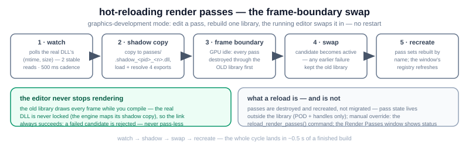

# render passes — executor, pass sets, hot-reload

How zircon's rendering is organized: a statically-linked executor plus a pass
library that becomes hot-swappable in graphics-development mode. Audience:
engine programmers touching passes or the pass sets. This file is maintained
alongside the code — a change to the pass lifecycle, the resolution chain, or
the reload protocol updates this page (and `../zircon_render_passes_hotreload.svg`)
in the same commit.

## 1. The two-project split

- **Executor — `zircon.render`** (`src/render/bgfx/`): `zircon_renderer_bgfx`
  (a `ktkIRenderer`) owns the frame (update → passes → present) and up to
  `ZIRCON_DEF_RENDERER_BGFX_MAX_RENDER_GRAPH_COUNT` (= 2)
  `ktkRenderGraphSimplified` instances — one ordered pass list per session
  (editor / game). GPU resources (textures, shaders, geometry buffers) stay
  executor-side; passes reference them by handle, so a reload orphans nothing.
- **Pass library — `zircon.render.passes.bgfx`**
  (`src/render/bgfx/passes/no_streaming/`): the concrete passes (present,
  editor grid, editor CSG, the two gizmos, imgui, model_static,
  model_static_gpu_driven, …). STATIC `.lib` in the default configuration —
  zero overhead, byte-identical behavior; a DLL
  (`passes/zircon.render.passes.bgfx.dll`) under
  `-DZIRCON_GRAPHICS_DEVELOPMENT=ON` (see §4).
- **The seam is a narrow C ABI** (signatures at
  `src/render/bgfx/zircon_render_pass_library_manager.h:22-45`):
  `zircon_passlib_get_count()` / `zircon_passlib_get_name(i)` enumerate the
  registry, `zircon_passlib_create(name)` / `zircon_passlib_destroy(pass)`
  build and kill passes **inside the library** — an object never crosses the
  module boundary unowned (the cross-CRT / etl-terminator rules). The
  statically-linked twins and the DLL's exports share these exact signatures,
  so the executor routes to either without knowing which is active.
- **A pass is a plain object** over kotek's
  `ktkRenderGraphSimplifiedRenderPass` contract:
  `OnCreateResources` / `OnUpdate` / `OnRender` / `OnDestroyResources`. Passes
  carry POD and handles only — no shared ownership with the host, no static
  storage, no heap-owning members handed across the boundary.
- **Registration is codegen'd.** `zircon_render_pass_factory` (generated by
  `zircon_generator` at build time) maps registry names to pass classes per
  session (the contains-"editor" rule splits the two registries). Never edit
  the generator's output by hand.

## 2. Pass sets: config, scenes, the resolution chain

A **pass set** is an ordered, comma-separated list of registry names. Editor
and game sessions each have one.

- Config keys `render_passes_editor` / `render_passes_game` in
  `data_user/game_config.json`. Defaults
  (`src/core/zircon_config.h:65-73`): editor =
  `present → grid → editor_csg → gizmo_own → imgui` (imgui last — it draws
  the UI over everything; the gizmo is a depth-test-off overlay over the
  scene geometry); game = `present → model_static`.
- A level overrides the **game** set through its scene metadata
  `data_user/sdk/scenes/<name>/scene.json` (`{"render_passes": "..."}`) — the
  editor set is never level-overridden.
- The resolution chain (`src/engine/zircon_render_pass_set_resolver.h:157`,
  shared by the bgfx and NRI backends, each with its own registry and
  built-in default):
  1. the scene file's `render_passes` — present AND every name registered;
  2. the config's `render_passes_game` — non-empty AND valid;
  3. the built-in default.

  A source with an unknown name is dropped **loudly** (`KOTEK_MESSAGE_ERROR`,
  no assert — a hand-edited user file is runtime data, not a programmer
  error) and the chain falls through. The winning leg is logged at boot.
- The active game set is written back at module shutdown (the scene file when
  one is loaded, the config otherwise). Pass sets are **not** journaled —
  they are config/editor state, never undo/redo history.

### The classic ↔ GPU-driven A/B toggle

The game set has two alternate model paths (task Z24 B1):
`model_static` (per-item CPU submission, the default) and
`model_static_gpu_driven` (one-shot world collect into shared chunk pools,
compute frustum cull, one indirect draw). Switch by:

- the console command `render_passes_game_toggle_ab()` — live, through the
  same frame-boundary rebuild the window uses;
- editing `render_passes_game` (config or a scene's `scene.json`);
- or switching geometry paths entirely: the `render_geometry_path` config key
  / console command (`classic` ↔ `nanite`) — persisted, applied at the next
  boot (the render device and pass sets install at module init).

## 3. The Render Passes window

`src/editor/ui/zircon_ui_render_passes.cpp` — the left-docked editor window
(auto-opens on first start until "don't show on start again" is saved). Per
session section, in execution order:

- **enable/disable** — instant: flips the executor's skip flag; the pass
  keeps living (no destroy/create);
- **move up/down, remove, add** (from the "registered, not in the set" list)
  — structural edits run through a frame-boundary rebuild of the session's
  graph; a slot whose name the active library can't create is marked
  `[missing from library]` and dropped loudly at the rebuild;
- **gizmo mutual exclusion** — `gizmo_own` and `gizmo_imguizmo` never run
  together (enabling one disables the other; both off is legal);
- **dirty marker + Save** — compares the live set against the saved baseline
  (for the game session: the *resolved* baseline, so a level override is not
  "modified" on a fresh boot) and writes both sets back to
  `game_config.json`;
- **reload status line** — in graphics-development builds, one colored line
  reports change-detected / reloading / failed (old library active) /
  succeeded, fed by the renderer's phase transitions;
- after a hot-reload the window re-points its registry tables through the
  manager's generation counter — a pass added in the rebuild appears without
  an editor restart.

## 4. Hot-reload (graphics-development mode)

Build with `-DZIRCON_GRAPHICS_DEVELOPMENT=ON`; the runtime gate is the
`graphics_development` config key (default ON in these builds) or
`--graphics_development` for one run. The machine:
`zircon_render_pass_library_manager` (`src/render/bgfx/zircon_render_pass_library_manager.h`,
the contract is the class doc comment).

1. **Shadow-copy loading.** The engine never maps the real DLL — a loaded
   image is write-locked on Windows, which would block your next rebuild at
   the linker. Every load copies the real file to
   `passes/.shadow_<pid>_<n>.dll` (fresh counter per load) and maps that. A
   corrupt or mid-write candidate is rejected before the running library is
   touched.
2. **Watch.** A polling watcher (500 ms, change accepted after 2 consecutive
   stable (mtime, size) reads — a linker write is not atomic) sets one atomic
   flag, nothing else. `reload_render_passes()` at the console sets the same
   flag by hand. No locks anywhere: the swap runs at the top of `draw()`,
   the GPU-idle point.
3. **The frame-boundary swap** (three phases):
   `prepare_reload_candidate` (copy → shadow → load → resolve the 4 exports,
   never disturbing the active library) → the renderer destroys every pass
   **through the OLD library** → `commit_reload_candidate` (the candidate
   becomes active) → the session pass sets are recreated by name through the
   new library → `finish_reload` (unloads the replaced library, deletes its
   shadow, re-enumerates the registry, bumps the generation).
4. **Never pass-less.** Any failure before the commit keeps the old library
   running (the status line says so). The manager counts library-created vs
   library-destroyed passes and asserts the balance at unload.

The reload-safety laws, restated: passes are created and destroyed inside the
library, always before its unload; all watcher/registry/loading state lives
as members of the manager instance (no statics on the seam); GPU resources
stay executor-side. A reload **recreates** passes — it does not migrate
state; a pass that accumulates must keep that state outside the library.

Scope note: hot-reload is the bgfx pass library today (Windows). The NRI
passes (`zircon.render.passes.nri`, hand-written `zircon_nri_passlib`) are
already C-ABI-shaped for the same split; the reload mirror is a later phase.

## 5. What it costs (the honest list)

- The C ABI forbids rich types across the seam: names and opaque pointers
  in, POD and handles inside.
- The module-boundary rules (create/destroy in one module, no cross-CRT
  frees, no static storage) are enforced by review and asserts, not by the
  type system — violating them crashes at the swap, not at the edit.
- A reload is a rebuild of the pass set, not a diff: per-pass GPU resources
  are recreated (`OnCreateResources` runs again), so the swap is priced in
  passes × resource-creation cost — fine for a dev loop, not a per-frame
  mechanism.
- The editor and game graphs both rebuild at the swap; a pass set stored by
  name fails loudly (and keeps the old library) when the rebuild removed a
  pass the set references.
